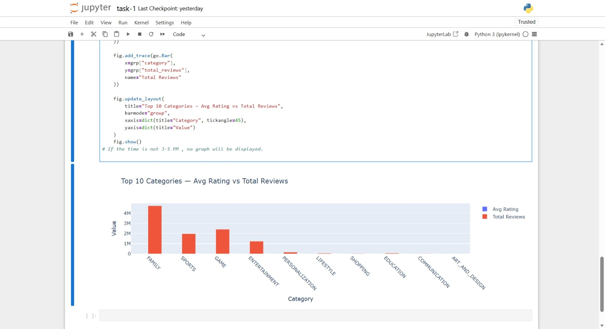
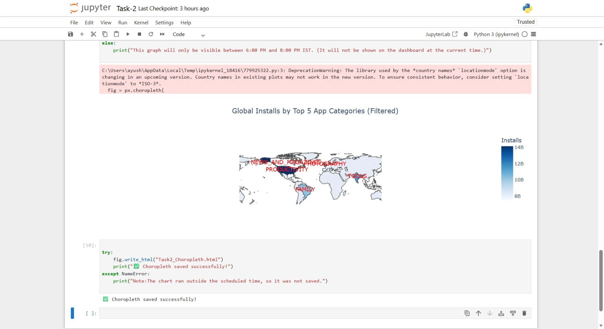
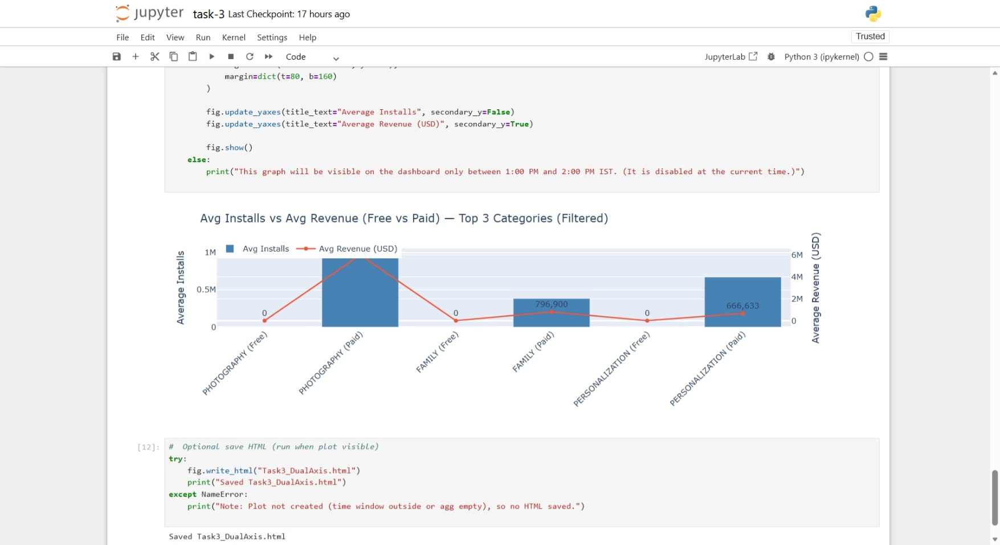
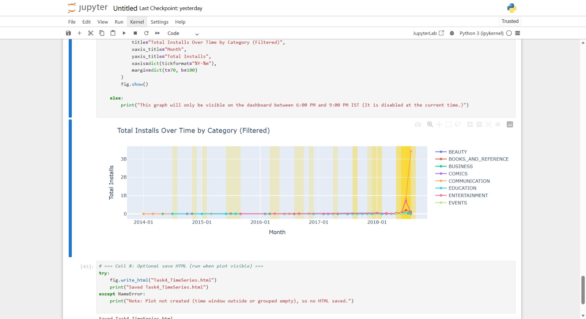
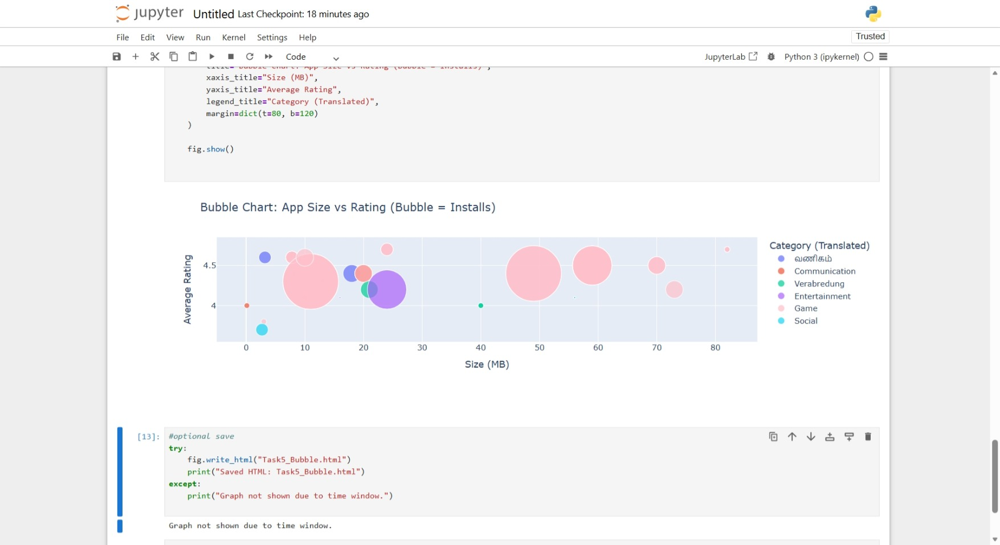
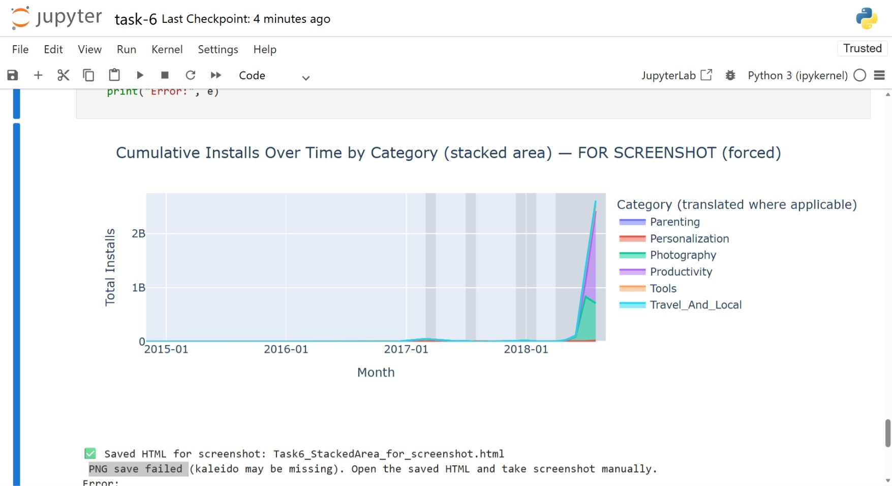

## Task-1 Grouped Bar Chart Output

## Task-2 Choropleth Map Output

## Task-3 Dual Axis Chart Output

## Task-4 Time Series Trend Output

## Task-5 Bubble Chart Output

## Task-6 Stacked Area Chart Output

